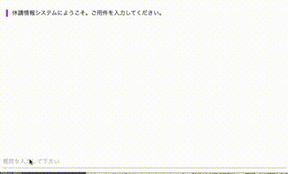
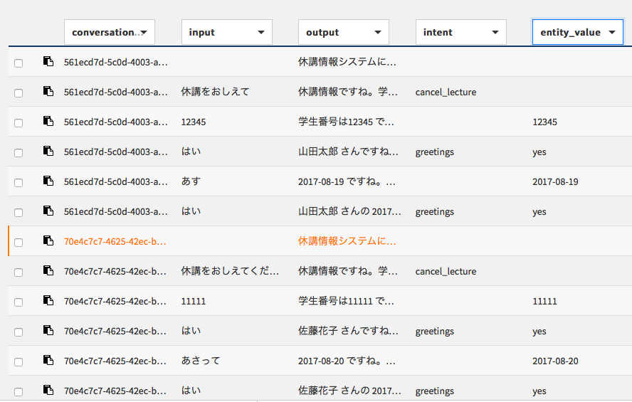
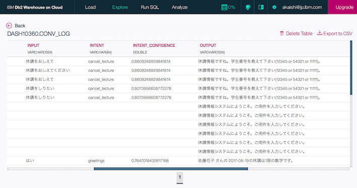
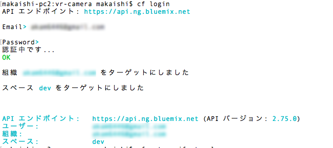
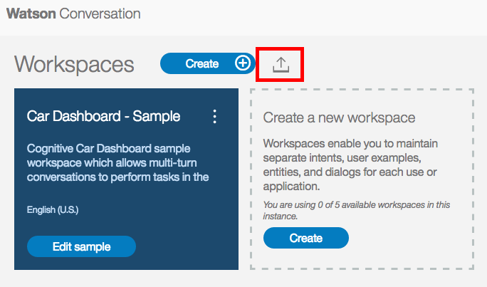
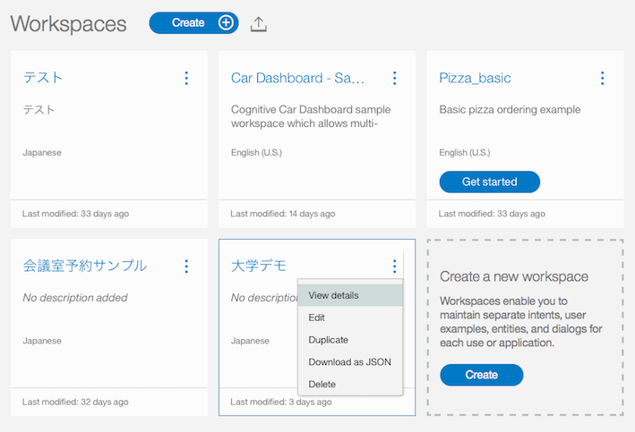
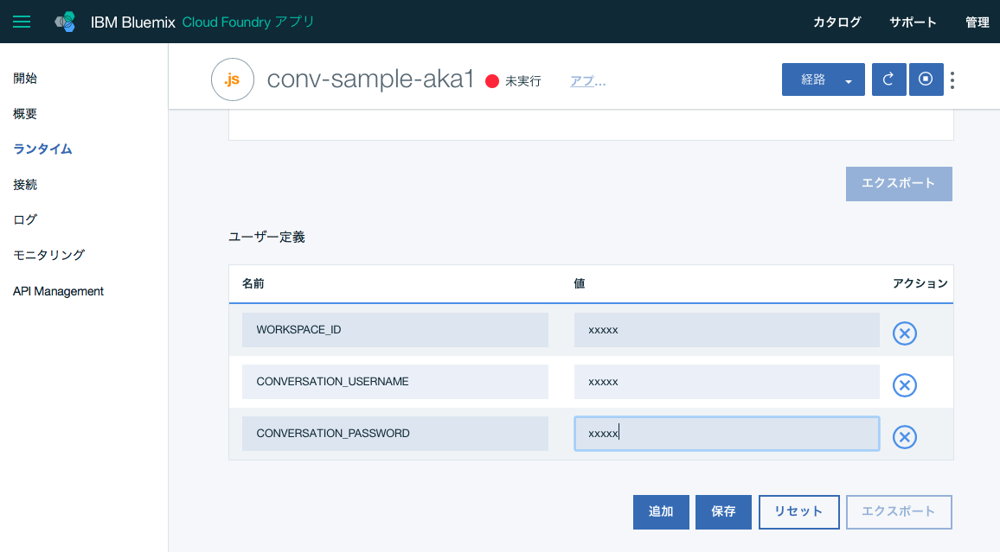
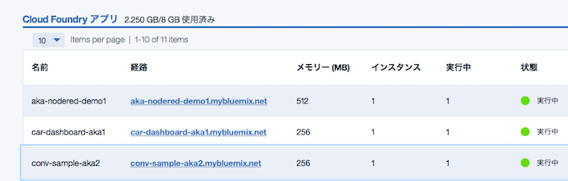

# Conversation サンプルアプリケーション
Watson APIのConversationは、機械学習モデルによる意図分類を含んだチャットボットのフローを簡単に作れるAPIです。  
しかし、このフローを本番の環境で動かすためには、APIの機能でカバーできていないユーザーインターフェイス用のアプリケーションサーバーを別途立てる必要があり、そのための開発も必要でした。  
このサンプルアプリケーションは、この問題を解決するためのものです。  
具体的には、Waston Developers Cloud上で公開されている[サンプルアプリ][conv_simple]を本番で使えるよう修正した上で、いくつかの便利機能を追加しています。  
次の点が特徴となっています。  
  
- 本番ですぐに使えるUI  
元のサンプルアプリではデバッグ用のペインが表示されていて、本番利用が難しかったのですが、この表示をなくしすぐに本番運用で使えるUIを提供しています。   

- デバッグ表示も可能  
オリジナルサンプルで使えたデバッグ用のペインを表示することも可能です。  
このためには次の２つのことを同時に行います。
  - 環境変数の設定  
    DEBUG_MODE=trueの設定を環境変数ないしはlocal.envで行います。
  - URLパラメータの指定  
    アプリ起動時のURLパラメータとして  
    \<url\>?debug\_mode=true  
   を追加します。
   
- 外部システム連携のひな形  
Conversation APIと外部システムの連携を行う場合の雛形コードが含まれています。  
外部連携に関するより詳細な解説は xxx を参照して下さい。

- ログ取得  
Cloudant DBのURLとDB名を指定するだけで会話ログが自動的に取得可能です。  
取得したデータは、Bluemix上の設定でdashDBと連携すればCSVにexportすることも可能です。


デモ画面  
  

  
ログサンプル  
  
  

cloudantのデータをdashDBに複製した結果 (CSV exportも可能)  

  
  
# 導入手順

## Bluemixアカウントの準備

[Bluemixアカウントを作る][sign_up] か、あるいは既存のBluemixアカウントを利用します。

## 前提ソフトの導入
次の前提ソフトを導入します。下記のリンク先からダウンロード後、それぞれ導入して下さい。

[gitコマンドラインツール][git]  
[Cloud Foundryコマンドラインツール][cloud_foundry]  
  
注意: Cloud Foundaryのバージョンは最新として下さい。 

## ソースのダウンロード
Githubからアプリケーションのソースをダウンロードします。  
カレントディレクトリのサブディレクトリにソースはダウンロードされるので、あらかじめ適当なサブディレクトリを作り、そこにcdしてから下記のコマンドを実行します。  
ダウンロード後、できたサブディレクトリにcdします。
 

```
$ cd (適当なサブディレクトリ)
$ git clone https://git.ng.bluemix.net/akaishi/conv-ui-sample.git
$ cd conv-ui-sample
```

## CFコマンドでログイン
CFコマンドでbluemix環境にログインします。ログイン名、パスワードはBluemixアカウント登録で登録したものを利用します。  
ログインに成功すると、次のような画面となります。  

```
$ cf login
```

  

## Conversationサービスの作成
Conversationサービスをまだ作成していない場合は、次のコマンドで作成します。

```
$ cf create-service conversation free conversation-1
$ cf create-service-key conversation-1 myKey
```

すでに作成済みのConversationと、このアプリケーションを接続したい場合は、manifest.ymlファイル内の、"conversation-1"と記載されている箇所を作成済みConversationサービス名に変更して下さい。(２箇所あります)
あるいは、管理画面から作成済みサービスの名称を"conversation-1"に変更してもいいです。

## Cloudantサービスの作成(オプション)
会話ログをCloudantに保存したいが、まだCloudant DBを作成していない場合は、次のコマンドで作成します。不要な場合はスキップします。

```
$ cf create-service cloudantNoSQLDB Lite cloudant-1
$ cf create-service-key cloudant-1 myKey
```

## Conversationサンプルワークスペースの作成

外部システムとの連携デモを動かすためには、ワークスペースもサンプルのものにする必要があります。  
サンプルワークスーペースはgitソースコード内の下記のパスにありますので、こちらをConversationにimportして下さい。

```
training/conv-sample-jp.json
```

手順の概要は以下の通りです。
* Blummixダッシュボードの画面から先ほど作った"conversation-1"サービスを選択
* 管理画面右上の"Launch tool"ボタンをクリック
* Watson Conversationの画面が出たら"Log in with IBM ID"
* 下記の画面が出たら、赤枠で囲んだアイコンをクリックし、ファイル名を指定してワークスペースのインポート

  

インポートが完了したら、
* Conversaionサービス管理画面から「Launch Tool」
* ワークスペースごとの詳細メニューから「View Deatails」を選択  
で、ワークスペースIDを確認し、エディタなどに保存しておきます。 
  
  


## アプリケーションのデプロイ

Cloudantのログ機能を使いたい場合は、mainfest.ymlファイル内のCloudantに関するコメント行の"#"をはずします。(全部で4行あります)
次のコマンドを実行します。
\<service_name\>はなんでもいいのですが、インターネット上のURLの一部となるので、ユニークな名前を指定します。
(例) conv-ui-aka1


```
$ cf push <service_name>
```

## 環境変数の設定

環境変数の値WORKSPACE_IDをCloudFoundary管理画面から、「ランタイム」「環境変数」を選択して設定します。  
    
  
  
CloudantDBへのログ保存を行う場合は、追加で次の環境変数の設定を行います。

```
CLOUDANT_DBNAME  
```
    
環境変数 CLOUDANT\_DBNAME が設定されていると、システムは自動的にログの保存を行います。  
Cloudant上にCLOUDANT\_DBNAMEの名前のDBがない場合は、自動的にDB作成も行います。   

## アプリケーションのURLと起動
環境変数を保存すると自動的に再構成が動き出します。  
しばらくしてこれが完了したら、下記の画面で該当するCloud Foundaryアプリケーションの「経路」のリンクをクリックするとアプリケーションが起動されます。  
  


[cloud_foundry]: https://github.com/cloudfoundry/cli#downloads
[git]: https://git-scm.com/downloads
[sign_up]: https://bluemix.net/registration
