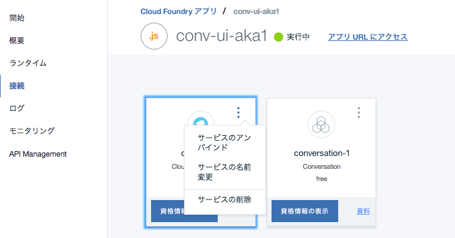

# Conversation サンプルアプリケーション
Watson APIのConversationは、機械学習モデルによる意図分類を含んだチャットボットのフローを簡単に作れるAPIです。  
しかし、このフローを本番の環境で動かすためには、APIの機能でカバーできていないユーザーインターフェイス用のアプリケーションサーバーを別途立てる必要があり、そのための開発も必要でした。  
このサンプルアプリケーションは、この問題を解決するためのものです。  
具体的には、Waston Developers Cloud上で公開されている[サンプルアプリ][conv_simple]を本番で使えるよう修正した上で、いくつかの便利機能を追加しています。  
次の点が特徴となっています。  
  
- 本番ですぐに使えるUI  
元のサンプルアプリではデバッグ用のペインが表示されていて本番利用が難しかったのですが、この表示をなくし、すぐに本番運用で使えるUIを提供しています。   

- ログ取得  
Cloudant DBのインスタンスを作成し、必要な設定をするだけで、会話ログを自動的に保存可能です。  
保存したデータは、Bluemix上の設定でdashDBと連携すればCSVにexportすることもできます。
   
- 外部システム連携のひな形  
Conversation APIと外部システムの連携を行う場合の雛形コードが含まれています。  
外部連携に関するより詳細なこれから別途作成予定です。

- デバッグ表示も可能  
オリジナルサンプルで使えたデバッグ用のペインを表示することも可能です。  


デモ画面  
  

  
ログサンプル  
  
  

cloudantのデータをdashDBに複製した結果 (CSV exportも可能)  

  
  
# 導入手順

## Bluemixアカウントの準備

[Bluemixアカウントを作る][sign_up] か、あるいは既存のBluemixアカウントを利用します。

## 前提ソフトの導入
次の前提ソフトを導入します。下記のリンク先からダウンロード後、それぞれ導入して下さい。

[gitコマンドラインツール][git]  
[Cloud Foundryコマンドラインツール][cloud_foundry]  
  
注意: Cloud Foundaryのバージョンは最新として下さい。 

## ソースのダウンロード
Githubからアプリケーションのソースをダウンロードします。  
カレントディレクトリのサブディレクトリにソースはダウンロードされるので、あらかじめ適当なサブディレクトリを作り、そこにcdしてから下記のコマンドを実行します。  
ダウンロード後、できたサブディレクトリにcdします。
 

```
$ cd (適当なサブディレクトリ)
$ git clone https://git.ng.bluemix.net/akaishi/conv-ui-sample.git
$ cd conv-ui-sample
```

## CFコマンドでログイン
CFコマンドでbluemix環境にログインします。ログイン名、パスワードはBluemixアカウント登録で登録したものを利用します。  
ログインに成功すると、次のような画面となります。  

```
$ cf login
```

  

## Conversationサービスの作成
Conversationサービスをまだ作成していない場合は、次のコマンドで作成します。

```
$ cf create-service conversation free conversation-1
$ cf create-service-key conversation-1 myKey
```

すでに作成済みのConversationとこのアプリケーションを接続したい場合は、manifest.ymlファイル内の、"conversation-1"と記載されている箇所を作成済みConversationサービス名に変更して下さい。(２箇所あります)
あるいは、管理画面から作成済みサービスの名称を"conversation-1"に変更してもいいです。

## Cloudantサービスの作成(オプション)
会話ログをCloudantに保存したいが、まだCloudant DBを作成していない場合は、次のコマンドで作成します。不要な場合はスキップします。

```
$ cf create-service cloudantNoSQLDB Lite cloudant-1
$ cf create-service-key cloudant-1 myKey
```

## Conversationサンプルワークスペースの作成

外部システムとの連携デモを動かすためには、ワークスペースもサンプルのものにする必要があります。  
サンプルワークスーペースはgitソースコード内の下記のパスにありますので、こちらをConversationにimportして下さい。

```
training/conv-sample-jp.json
```

手順の概要は以下の通りです。

* Blummixダッシュボードの画面から先ほど作った"conversation-1"サービスを選択
* 管理画面右上の"Launch tool"ボタンをクリック
* Watson Conversationの画面が出たら"Log in with IBM ID"
* 下記の画面が出たら、赤枠で囲んだアイコンをクリックし、ファイル名を指定してワークスペースのインポート

  

インポートが完了したら、

* Conversaionサービス管理画面から「Launch Tool」
* ワークスペースごとの詳細メニューから「View Deatails」を選択  

で、ワークスペースIDを確認し、エディタなどに保存しておきます。 
  
  


## mainfest.ymlの修正(オプション)

Cloudantのログ機能を使いたい場合は、mainfest.ymlファイル内のCloudantに関するコメント行の"#"をはずします。(全部で4行あります)  

## アプリケーションのデプロイ

次のコマンドを実行します。
\<service_name\>はなんでもいいのですが、インターネット上のURLの一部となるので、ユニークな名前を指定します。  
(例) conv-ui-aka1

```
$ cf push <service_name>
```

## 環境変数の設定

デブロイが正常に終了したら、CloudFoundary管理画面から、「ランタイム」「環境変数」を選択して環境変数の設定を行います。
設定する項目は次の3つです。

  

```
WORKSPACE_ID
CLOUDANT_DBNAME
DEBUG_MODE  
```

このうち、WORKSPACE\_IDは必須項目、CLOUDANT\_DBNAMEとDEBUG\_MODEはオプション項目となります。  

WORKSPACE\_IDの値には、前の手順で確認したidを設定して下さい。

CLOUDANT\_DBNAMEは、ログの保存をしたい場合に、保存先DB名を指定します。
(DBが存在しない場合は、自動的に作成されます)  

DEBUG用のペインも表示したい場合は、DEBUG\_MODEに値"true"を指定します。
この場合、アプリ起動時のURLにも追加オプションを入れる必要があります(後述)。

## アプリケーションのURLと起動
環境変数を保存すると自動的に再構成が動き出します。  
しばらくしてこれが完了したら、アプリケーションの完成です。以下のURLを指定してアプリケーションを起動して下さい。

```
https://<service_name>.mybluemix.net
```

デバッグモードで起動したい場合は、以下のURLとします。

```
https://<service_name>.mybluemix.net?debug_mode=true
```

ログ取得の設定をしている場合は、簡単な会話を流したあとで、Cloudant DBの管理画面を表示し、ログが取得されていることを確認して下さい。

## 接続先Convesationの切替え方法
接続先Conversationを切り替えたい場合は、CloudFoundaryアプリケーション管理画面で、サービスのアンバインド(下図参照)を行い、その後で新しいサービスをバインドしなおします。

  

また、環境変数の設定でWORDSPACE_IDの値も変更します。


## アプリケーションの修正
Bluemixで稼働しているNode.jsアプリケーションのソースは git cloneコマンドでダウンロードしたローカルファイルです。このソースを修正して、再度 "cf push \<service_name\>"コマンドを実行すると、Bluemix上のアプリケーションにも修正が反映されます。  
自分でアプリケーションコードを開発したい場合は、このサンプルソースを雛形に試してみると、効率よくアプリケーション開発ができます。


## ローカルで起動する場合

アプリケーションを修正する時は、ローカルでもテストできる方が便利です。そのための手順は以下の通りです。

* Node.jsの導入  
ローカルにNode.jsを導入する必要があります。
[Node.jsダウンロード][node_js]からダウンロードして下さい。
* 認証情報の確認  
BluemixダッシュボードからConversationサービスの管理画面を開き、username, passwordの値を調べてテキストエディタなどにコピーします。
* local.envファイルの設定
次のコマンドでlocal.envファイルの雛形からlocal.envをコピーし、エディタで調べたusername, passwordを設定します。

```
$ cp local.env.sample local.env
```

```
CONVERSATION_USERNAME=xxxxxxxx-xxxx-xxxx-xxxx-xxxxxxxxxxxx
CONVERSATION_PASSWORD=xxxxxxxxxxxx
```
* Node.jsアプリケーションの導入、実行
以下のコマンドでアプリケーションの導入、実行を行います。

```
$ npm install
$ npm start
```

### (参考) Bluemixとローカル両方で動くアプリの作り方
qittaに別記事 [Bluemix上のWatsonアプリをローカル環境で開発・デバッグする際のTips](https://qiita.com/makaishi2/items/06dd45ae50891d66aef5) をあげておきましたので、関心ある方はこちらも参考にされて下さい。

[node_js]: https://nodejs.org/ja/download/
[conv_simple]: https://github.com/watson-developer-cloud/conversation-simple  
[cloud_foundry]: https://github.com/cloudfoundry/cli#downloads
[git]: https://git-scm.com/downloads
[sign_up]: https://bluemix.net/registration
