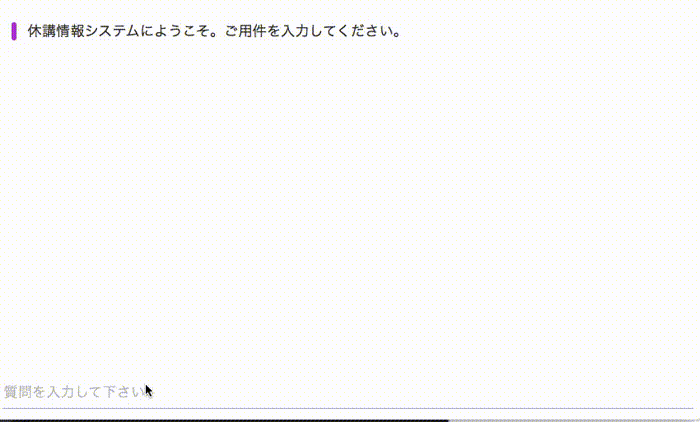
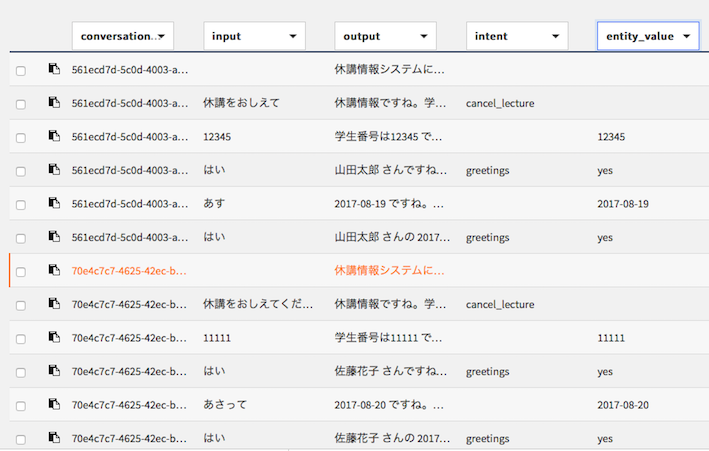
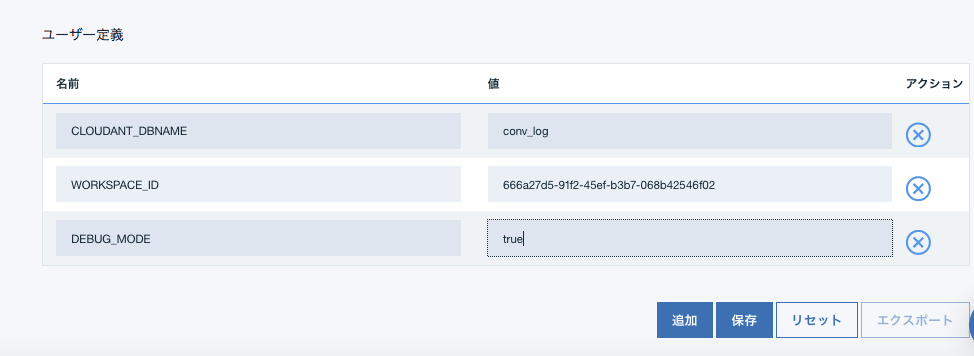
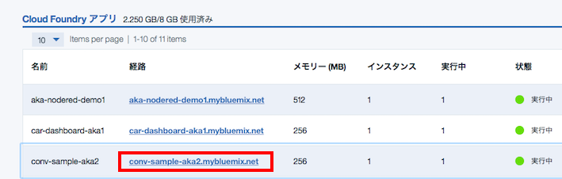

# Conversation サンプルアプリケーション
このアプリケーションはWaston Developers Cloud上で公開されている[サンプルアプリ][conv_simple]をベースにいくつかの便利機能を追加したものです。  
次の点が特徴となっています。  
  
- 本番ですぐに使えるUI  
元のサンプルアプリではデバッグ用のペインが表示されていて、本番利用が難しかったのですが、この表示をなくしすぐに本番運用で使えるUIを提供しています。   

- デバッグ表示も可能  
オリジナルサンプルで使えたデバッグ用のペインを表示することも可能です。  
このためには次の２つのことを同時に行います。
  - 環境変数の設定  
    DEBUG_MODE=trueの設定を環境変数ないしは.envで行います。
  - URLパラメータの指定  
    アプリ起動時のURLパラメータとして  
    \<url\>?debug\_mode=true  
   を追加します。
   
- 外部システム連携のひな形  
Conversation APIと外部システムの連携を行う場合の雛形コードが含まれています。外部連携に関するより詳細な解説は xxx を参照して下さい。

- ログ取得  
Cloudant DBのURLとDB名を指定するだけで会話ログが自動的に取得可能です。取得したデータは、Bluemix上の設定でdashDBと連携すればCSVにexportすることも可能です。


デモ画面  
  

  
ログサンプル  
  
  

cloudantのデータをdashDBに複製した結果 (CSV exportも可能)  

  
  
  
## 事前準備

### Bluemixアカウントの準備
   [Bluemixアカウントを作る][sign_up] か、あるいは既存のBluemixアカウントを利用します。
 
### 前提ソフトの導入
 次の前提ソフトを導入します。Node.jsはローカルで動かす場合に必要となります。 
   
  [gitコマンドラインツール][git]   
  [Cloud Foundryコマンドラインツール][cloud_foundry]  
  [Node.js][node_js] 

  注意: Cloud Foundaryのバージョンは最新として下さい。

### ソースのダウンロード
カレントディレクトリのサブディレクトリにソースはダウンロードされるので、あらかじめ適当なサブディレクトリを作り、そこにcdしておきます。

```
git clone https://git.ng.bluemix.net/akaishi/conv-ui-sample.git
```

### サンプルワークスペースの作成
外部システムとの連携デモを動かすためには、ワークスペースもサンプルのものにする必要があります。  
サンプルワークスーペースはgitソースコード内の下記のパスにありますので、こちらをConversationにimportして下さい。

```
training/conv-sample-jp.json
```

### 環境変数の確認
以下の3つの環境変数の値を調べます。

```  
CONVERSATION_USERNAME  
CONVERSATION_PASSWORD  
WORKSPACE_ID  
```  
  
USERNAMEとPASSWORDは、Conversationサービス管理画面から「資格情報」「資格情報の表示」を選択  
  
  
  
  
  
WORDSPACE_IDは、Conversaionサービス管理画面から「Launch Tool」ワークスペースごとの詳細メニューから「View Deatails」を選択  
  
  
  

    
CloudantDBへのログ保存を行う場合は、保存先CloudantDBのURL(userid, passwordも含めた形式のもの)についても確認して下さい。
  

## ローカル環境へのデプロイ

### プログラムの導入

次のコマンドを実行して必要なモジュールを導入します。

```
cd conv-ui-sample
npm install
```

### 環境変数の設定

カレントディレクトリにあるexample.envをテキストエディタで開いて、下記の項目にそれぞれの値を設定して下さい。  
ログファイル取得を行う場合には、CLOUDANT_XXXの2行の行頭の"#"を消してコメントをはずし、値を設定します。  

```          
WORKSPACE_ID=xxxxxxxx-xxxx-xxxx-xxxx-xxxxxxxxxxxx
CONVERSATION_USERNAME=xxxxxxxx-xxxx-xxxx-xxxx-xxxxxxxxxxxx
CONVERSATION_PASSWORD=xxxxxxxxxxxx
DEBUG_MODE=false
#CLOUDANT_DBNAME=conv_log
#CLOUDANT_URL='https://xxxxxxxx-xxxx-xxxx-xxxx-...
```    
      
設定が完了したら、次のコマンドで結果を .envにコピーしたのち、ローカルでnode.jsを起動します。
  
```
cp example.env .env
npm start
```

正常にNode.jsが起動できていれば、ブラウザから [http://localhost:3000][local_url] のURLでアプリケーションを起動できます。
  
## Bluemix環境へのデプロイ

### プログラムの配布

cf loginコマンドではemailとpasswordを聞かれるのでbluemix登録時のemailアドレスとパスワードを指定します。   
cf pushコマンドで指定する \<your\_appl\_name\> はBluemix上のインスタンス名であると同時に、インターネット上のURL名にもなるので、ユニークなものを指定します。  

```
cd conv-ui-sample
cf login
cf push <your_appl_name>
```
  
### 環境変数のセット
前の手順でローカル環境でNode.jsを動かしている場合、cf pushコマンドで.envファイルのコピーも行われるので、以下の手順は必要ありません。  
この手順はローカルでのテストを省いてBluemix上で動かす場合、または継続的開発環境の設定をBluemix上で行いGithub上のソースをBluemix環境に直接デプロイする場合に必要となります。 
  
３つの環境変数の値をCloudFoundary管理画面から、「ランタイム」「環境変数」を選択して設定します。  
  
    
  
  
  
CloudantDBへのログ保存を行う場合は、追加で次の２つの環境変数の設定を行います。

```
CLOUDANT_URL  
CLOUDANT_DBNAME  
```
    
環境変数 CLOUDANT\_DBNAME が設定されていると、システムは自動的にログの保存を行います。  
Cloudant上にCLOUDANT\_DBNAMEの名前のDBがない場合は、自動的にDB作成も行います。   

### アプリケーションのURLと起動
環境変数を保存すると自動的に再構成が動き出します。  
しばらくしてこれが完了したら、下記の画面で該当するCloud Foundaryアプリケーションの「経路」のリンクをクリックするとアプリケーションが起動されます。  
  

  
[conv_simple]: https://github.com/watson-developer-cloud/conversation-simple  
[node_js]: https://nodejs.org/#download
[cloud_foundry]: https://github.com/cloudfoundry/cli#downloads
[git]: https://git-scm.com/downloads
[npm_link]: https://www.npmjs.com/
[sign_up]: https://bluemix.net/registration
[demo]: https://git.ng.bluemix.net/akaishi/conv-ui-sample/blob/master/readme_images/conv-sample2.gif
[local_url]: http://localhost:3000